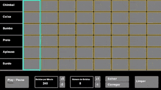

# Project Drum Electronic 
Este projeto visa o desenvolvimento de uma bateria eletrônica usando arquivos de audio para gerar som.

#### Meus Comentários

Neste projeto é possivel criar musica baseado em sons de uma bateria eletrônica, é possivel salvar as musicas, e também carregar as musicas que foram salvas, para o desenvolvimento deste projeto foi utilizado um tutorial do freecodeCamp.org que está nas refências no final deste documento.

Tive a oportunidade de conhecer e praticar um pouco mais de Python, aprendi muito com essa experiência, um dos desafios foi o uso da biblioteca pygame, que não conhecia até a execução deste projeto. Foi utilizado o Visual Studio Code como ferramenta para desenvolvimento do código e o Git e Github para commitar e publicar o repositório.

Clique na imagem para ouvir o som

#
#### Para executar o projeto, siga os passoa abaixo:

1. Clone o repositório

- `git clone https://github.com/jlfagundes/project_drum_electronic.git`.
- Entre na pasta do repositório que você acabou de clonar:
  - `project_drum_electronic`

2. Crie o ambiente virtual para o projeto

- `python3 -m venv .venv && source .venv/bin/activate`

3. Instale as dependências

- `python3 -m pip install -r requirements.txt`

4. Execture o arquivo main.py
- `python3 main.py`

#### Referências
- <a href="https://www.freecodecamp.org/news/create-a-drum-machine-with-python-and-pygame/">Drum Machine with Python and Pygame – Full Project Course - freeCodeCamp.org</a>
- <a href="https://hiphopmakers.com/40-free-music-producer-free-drum-kits">Songs files</a>

